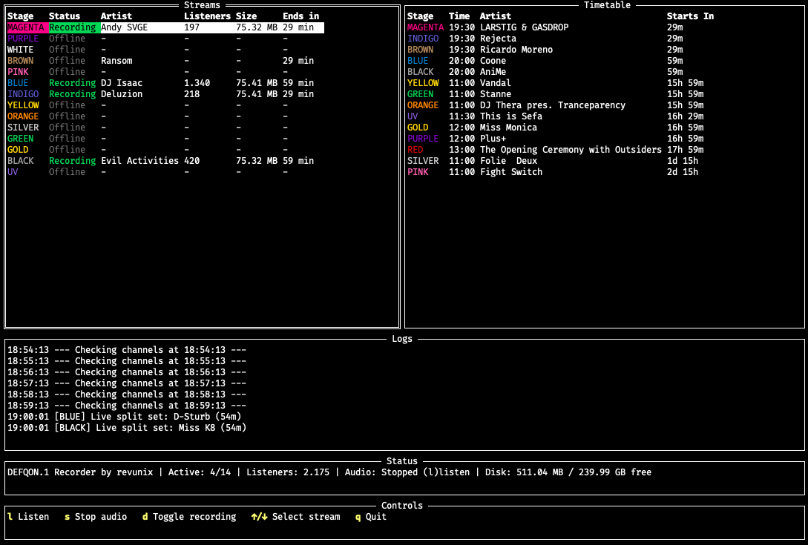

# DEFQON.1 Stream Recorder

A powerful terminal-based application for recording DEFQON.1 streams with a beautiful TUI (Terminal User Interface). Built in Go as a single static binary, it watches every Mixlr stage, records live DJ sets the moment they go online, and can also monitor configured YouTube event streams on native Windows/macOS builds.



<a href='https://ko-fi.com/revunix' target='_blank'></a>

## Features

- **Simultaneous recording** of all 14 Mixlr stages
- **Live TUI dashboard** with stream/timetable tables plus a YouTube table on supported native builds
- **Online & offline tracking** — every stage is always listed, with its current state
- **Real stage colors** — each stage is rendered in its actual DEFQON.1 signature color
- **Real-time listener counts**, file sizes and set-end countdowns
- **Built-in timetable** with DJ set times, current-DJ detection and "starts in" countdowns
- **Live detection** straight from the Mixlr `data.attributes.live` flag
- **Robust recovery** — stalled streams are detected and restarted automatically
- **In-TUI audio playback** — listen to any live stream right in the terminal (`l` / `s`, macOS/Windows builds)
- **Experimental YouTube live recording** — native Windows/macOS builds can monitor configured YouTube event streams and record the live feed when it starts
- **YouTube video preview** — open the selected YouTube feed in bundled `mpv` (`v`) or fullscreen (`f`), then close it with `Esc`
- **Selective recording** — toggle individual channels on/off (`d`); skipped stages show **Skip** and are never recorded
- **Persisted preferences** — stage toggles and YouTube recording modes are saved to `recorder.ini` and restored on restart
- **Scene-style file naming** — recordings are named like audio-scene releases (e.g. `DEFQON.1.2026.BLUE.…-USER`)
- **ID3 tags + artwork** — per-set files are tagged (artist=DJ, album, year, genre) with the Mixlr channel artwork embedded
- **Per-set splitting** — the raw recording is kept untouched; a per-stage folder holds one tagged MP3 per timetable set
- **Disk usage** — total recorded size and free space shown live in the status bar
- **Cross-platform** — one static binary for macOS, Linux and Windows (no runtime needed)
- **Graceful shutdown** — `q`, `Ctrl+C` and Docker `SIGTERM` all finish recordings cleanly

## The Interface

The dashboard is split into the main stream/timetable view plus logs, status and controls. On native Windows/macOS builds, a YouTube table is shown next to the log panel.

```
┌─ Streams ──────────────────┐ ┌─ Timetable ───────────────┐
│ Stage Status Artist ...    │ │ Stage Time Artist Starts  │
│  RED  Rec.  Atmozfears ... │ │  UV  13:00 ...    2h 15m  │
│ BLUE  Skip      -     -    │ │ RED  14:00 ...    3h  0m  │
│  ...                       │ │  ...                      │
├─ Logs ───────────────────────────────────────────────────┤
│ 13:00:02 --- Checking channels at 13:00:02 ---           │
│ 13:00:03 [RED] Starting recording...                     │
├─ Status ─────────────────────────────────────────────────┤
│ Active: 1/14 | Total Listeners: 12.345 | Audio: Playing  │
├─ Controls ───────────────────────────────────────────────┤
│ (l) Listen  (s) Stop  (d) Toggle  (↑/↓) Select  (q) Quit │
└──────────────────────────────────────────────────────────┘
```

- **Streams** (left) lists every stage with `Stage | Status | Artist | Listeners | Size | Ends in`.
  Status colors: <span style="color:#00C853">**Recording**</span> (green),
  <span style="color:#FFD600">**Online**</span> (yellow),
  <span style="color:#7A7A7A">**Offline**</span> (gray),
  <span style="color:#00BFA5">**Skip**</span> (teal — recording disabled for this channel).
- **Timetable** (right) shows the next upcoming set per stage with `Stage | Time | Artist | Starts In`.
- **YouTube** (next to Logs on supported native builds) shows each configured feed with `Day | Mode | State | Rec | mpv | Check`.
- **Status** summarizes active recordings, total listeners and the TUI audio state.
- **Controls** is an always-visible keybinding legend.
- Stage names appear in their real color (RED, BLUE, MAGENTA, UV, …).

## Tech Stack

- **Language:** Go (1.26+)
- **TUI:** [tview](https://github.com/rivo/tview) / [tcell](https://github.com/gdamore/tcell)
- **Recording:** [yt-dlp](https://github.com/yt-dlp/yt-dlp) + [FFmpeg](https://ffmpeg.org/)
- **YouTube preview:** [mpv](https://mpv.io/) on native Windows/macOS builds

## Architecture

The codebase follows a strict separation of concerns — the UI only renders
snapshots produced by the domain packages.

```
cmd/recorder/        Entrypoint: wiring, signal handling, graceful shutdown
internal/
  config/            Environment-driven configuration & channel list
  logging/           Minimal Logger interface (no silent failures)
  mixlr/             Mixlr JSON:API client (live flag + broadcast stream URL)
  timetable/         Timetable loader, current & upcoming set queries
  recorder/          yt-dlp process manager, scene-style naming, stalled monitor
  youtube/           YouTube live monitor, best-quality video capture + separate MP3
  controller/        Channel-check scheduling, recording-enable policy + toggles
  status/            Per-channel stream state (online/offline) registry
  listener/          In-TUI audio playback via ffmpeg → oto (macOS/Windows; Linux stub)
  prefs/             Persisted recording-toggle preferences (INI store)
  tools/             Bundled yt-dlp / ffmpeg / mpv discovery (bundled dir → PATH)
  tui/               tview dashboard (tables, logs, status, controls) + channel logger
  util/              Shared helpers (formatting, sanitization, timezone, system user)
```

Data flow: `Controller → Mixlr client → Recorder → yt-dlp`, with the `status`
registry feeding the TUI, the `timetable` enriching artist/ends-in columns,
recording toggles flowing `TUI → Controller (policy) → prefs`, and TUI audio
flowing `TUI → listener → ffmpeg → oto`.
YouTube recording is a separate native Windows/macOS flow:
`youtube.Manager → yt-dlp + ffmpeg`, with `mpv` used only for optional preview.

## Getting Started

### Runtime prerequisites

**Prebuilt releases bundle yt-dlp and FFmpeg** — extract and run, nothing else to install.
Native Windows/macOS release archives also bundle **mpv** for YouTube preview.

If you build from source (or want to use your own copies), the app looks for
`yt-dlp`, `ffmpeg` and `mpv` next to its own binary (or in `TOOLS_DIR`) first, then
falls back to your `PATH`. Install them only if you are not using a bundled release:

- [yt-dlp](https://github.com/yt-dlp/yt-dlp) — stream downloading
- [FFmpeg](https://ffmpeg.org/) — audio conversion (MP3)
- [mpv](https://mpv.io/) — YouTube video preview on Windows/macOS

### Option A — Prebuilt binary (no Go required)

Grab a release archive from `dist/` (produced by `make release`, see below) for
your platform, extract it and run:

```bash
# macOS / Linux
tar -xzf defqon-recorder-*-darwin-arm64.tar.gz
cd defqon-recorder-*-darwin-arm64
./defqon-recorder-darwin-arm64
```

```powershell
# Windows (PowerShell)
Expand-Archive defqon-recorder-*-windows-amd64.zip
cd defqon-recorder-*-windows-amd64
.\defqon-recorder-windows-amd64.exe
```

Each archive is fully self-contained: it bundles the binary, **yt-dlp, FFmpeg**
and `dq-timetable.json`, so it runs out of the box with zero external installs.
Windows/macOS archives also include **mpv** for YouTube preview.

### Option B — Build from source

```bash
git clone https://github.com/revunix/DEFQON.1-Recorder.git
cd DEFQON.1-Recorder
make run        # builds and launches the recorder
```

Or with plain Go:

```bash
go build -o defqon-recorder ./cmd/recorder
./defqon-recorder
```

## Cross-platform releases

Build static binaries for all platforms and bundle distributable archives:

```bash
make release
```

This produces the following in `dist/` (CGO disabled → fully static). Archives
bundle yt-dlp + FFmpeg so they are self-contained; native Windows/macOS archives
also bundle mpv for YouTube preview:

| Platform            | Binary                              | Archive     |
|---------------------|-------------------------------------|-------------|
| macOS (Apple Silicon) | `defqon-recorder-darwin-arm64`    | `.tar.gz`   |
| macOS (Intel)         | `defqon-recorder-darwin-amd64`    | `.tar.gz`   |
| Linux (x86-64)        | `defqon-recorder-linux-amd64`     | `.tar.gz`   |
| Linux (arm64)         | `defqon-recorder-linux-arm64`     | `.tar.gz`   |
| Windows (x86-64)      | `defqon-recorder-windows-amd64.exe` | `.zip`    |
| Windows (arm64)       | `defqon-recorder-windows-arm64.exe` | `.zip`    |

The version in the archive name is derived from `git describe` — set a tag
(e.g. `git tag v1.0.0`) before releasing for clean versioned names.

## Docker

```bash
make docker
docker run --rm -it -v "$PWD/recordings:/app/recordings" defqon-recorder
```

The image bundles yt-dlp and FFmpeg, so only Docker is required to run it.
Mount a volume to persist your recordings.
Recording preferences (`recorder.ini`) are stored inside the recordings volume
automatically (`PREFERENCES_PATH=/app/recordings/recorder.ini`), so your channel
toggles survive container restarts — no extra mount needed.
TUI audio playback (`l`) is only available on the native macOS/Windows builds;
the Linux/Docker build runs headless without an audio backend. YouTube recording
and mpv preview are also disabled in Linux/Docker for now.

## Controls

| Key          | Action                                              |
|--------------|-----------------------------------------------------|
| `↑` / `↓`    | Select a stream in the Streams table                |
| `l`          | Listen to the selected live stream inside the TUI   |
| `s`          | Stop TUI audio playback                             |
| `d`          | Toggle selected stage recording or selected YouTube mode |
| `Tab`        | Switch focus between Streams and YouTube tables     |
| `v`          | Open the selected YouTube feed in mpv               |
| `f`          | Open the selected YouTube feed fullscreen in mpv    |
| `Esc`        | Close the mpv YouTube preview                       |
| `q`          | Quit (graceful shutdown of all recordings)          |
| `Ctrl+C`     | Quit (graceful shutdown of all recordings)          |
| `SIGTERM`    | Graceful shutdown (e.g. `docker stop`)              |

For Mixlr, a channel with recording disabled shows **Skip** in the status column: its live
stream is still detected and can be listened to, but it is never recorded.

Disabled channels are remembered in a preferences file (`recorder.ini` by
default) so the choice survives a restart — you don't have to toggle them off
again every time. The file is rewritten automatically whenever you press `d`,
but it is plain text and can also be edited by hand:

```ini
[recording]
defqon1blue=on
defqon1red=off

[youtube]
Friday=video_audio
Saturday=audio
Sunday=none
```

## YouTube Streams

Native Windows/macOS builds also monitor a small configured list of YouTube
event streams. Linux/Docker builds do not run the YouTube recorder yet.

This part is experimental and has not been tested as heavily as the Mixlr
recorder. The video recorder keeps the best source quality YouTube exposes, so
long live streams can use a lot of disk space, especially when 1440p or 4K is
available.

Current configured YouTube feeds:

| Day      | URL |
|----------|-----|
| Friday   | `https://www.youtube.com/watch?v=tY4BNcXezb0` |
| Saturday | `https://www.youtube.com/watch?v=W8h8JMNjQ1E` |
| Sunday   | `https://www.youtube.com/watch?v=AkNo5ckWTBk` |
| Test     | `https://www.youtube.com/watch?v=uXNU0XgGZhs` |

The `Test` feed is temporary and can be removed from `internal/config/config.go`
after validation.

Behavior:

- On startup, each feed is checked with `yt-dlp`.
- Each feed has a recording mode: `Video+MP3`, `MP3`, or `Off`.
- Use `Tab` to focus the YouTube table and `d` to cycle the selected feed through
  `Video+MP3 -> MP3 -> Off`.
- If a feed is not live yet, the app shows `Not live` and checks again every
  30 seconds.
- If a feed becomes live and its mode is not `Off`, the app starts recording the
  live feed from the live edge, not from the start of the DVR window.
- If the live feed ends, the app stops and finalizes the recording.
- If a recording stalls or exits unexpectedly, the app retries on the next live
  check.
- YouTube modes are saved in `recorder.ini` under `[youtube]` as
  `video_audio`, `audio`, or `none`.

Depending on the selected YouTube mode, the app writes:

- `Video+MP3`: a best-source-quality video file, selected by `yt-dlp` with
  `bestvideo+bestaudio/best` and saved as `.mkv`.
- `Video+MP3`: a separate 320k MP3 file for audio-only listening.
- `MP3`: only the 320k MP3 file, with no `.mkv` video file.
- `Off`: no YouTube recording for that feed.

| Mode        | Video file | MP3 file | Use when |
|-------------|------------|----------|----------|
| `Video+MP3` | Yes        | Yes      | You want the full livestream recording and audio copy |
| `MP3`       | No         | Yes      | You want to save disk space and keep only audio |
| `Off`       | No         | No       | You do not want that YouTube feed recorded |

The video selector is intentionally uncapped. If YouTube exposes 4K, 1440p or
1080p60 at recording time, `yt-dlp` can select it. If YouTube only exposes
1080p30 or 1080p60 for a live stream, that is the highest quality the app can
record without re-encoding or upscaling. Higher source quality also means larger
files; make sure the recordings drive has enough free space before leaving it
running.

YouTube preview uses bundled `mpv` on Windows/macOS. Use `Tab` to focus the
YouTube table, `v` to open the selected feed in mpv, `f` to open it fullscreen,
and `Esc` to close the mpv preview. Video is rendered by the native mpv window,
not inside the terminal grid.

## File Naming

Recordings are saved as MP3 using an audio-scene-style release name:

```
DEFQON.1.{YEAR}.{STAGE}.{YYYYMMDD}.{HHMM}.LIVE.MP3-{USER}
```

Example: `DEFQON.1.2026.BLUE.20260626.1800.LIVE.MP3-revunix`

| Segment   | Meaning                                            |
|-----------|----------------------------------------------------|
| `DEFQON.1`| Release title                                      |
| `2026`    | Event year                                         |
| `BLUE`    | Stage                                              |
| `20260626`| Recording date (UTC)                               |
| `1800`    | Recording start time (UTC, HHMM) — keeps separate sets unique |
| `LIVE`    | Source                                             |
| `MP3`     | Format                                             |
| `revunix` | Release group (your OS user name)                 |

Special characters in the stage or group are stripped automatically.

YouTube recordings use the same release-style shape. Video files use a
`YOUTUBE` source marker and `BEST` quality marker; MP3-only mode writes only the
`.mp3` filename:

```
DEFQON.1.{YEAR}.YOUTUBE.{DAY}.{YYYYMMDD}.{HHMM}.LIVE.BEST-{USER}.mkv
DEFQON.1.{YEAR}.YOUTUBE.{DAY}.{YYYYMMDD}.{HHMM}.LIVE.MP3-{USER}.mp3
```

### Per-set splitting & ID3 tags

After a recording finishes, each stage also gets a subfolder of **tagged,
per-set MP3s** — one file per timetable set, cut from the raw recording
(with `-c:a copy`, so no re-encode and no quality loss). The raw file in the
recordings root is never modified.

**Cuts happen live**: while a recording is running, each set is cut as soon as
its end time is reached, so per-set files appear in real time. When the
recording stops (stream goes offline, toggled off, or the app quits), the
in-progress set is finalized as the last cut.

```
recordings/
├── DEFQON.1.2026.UV.20260626.1255.LIVE.MP3-revunix.mp3   ← raw recording (kept)
└── UV/
    ├── DEFQON.1.2026.UV.Angerfist.20260626.1300.LIVE.MP3-revunix.mp3
    └── DEFQON.1.2026.UV.DBlockSteFan.20260626.1400.LIVE.MP3-revunix.mp3
```

Each split carries ID3 tags (title, artist=DJ, album, year, genre) and the
Mixlr channel artwork as embedded cover art. The genre tag is **stage-specific**
(e.g. BLUE → Rawstyle, UV → Euphoric Hardstyle, BLACK → Hardcore); stages that
are not mapped fall back to `ID3_GENRE` (default `Hardstyle`). Disable splitting
with `SPLIT_SETS=false`; customize the album and fallback genre via `ID3_ALBUM`
/ `ID3_GENRE`.

## Configuration

The application works with sensible defaults — no configuration required.

### Environment Variables

| Variable               | Description                                  | Default             |
|------------------------|----------------------------------------------|---------------------|
| `RECORDINGS_DIR`       | Directory to save recordings                 | `./recordings`      |
| `TIMETABLE_PATH`       | Path to the timetable JSON                   | `dq-timetable.json` |
| `TOOLS_DIR`            | Directory with bundled yt-dlp / ffmpeg / mpv | exe directory       |
| `TEST_MIXLR_CHANNEL`   | Optional extra Mixlr channel slug for testing | unset               |
| `RECORDING_BLACKLIST`  | Comma-separated channel slugs that should not be recorded (initial defaults; `recorder.ini` overrides) | unset |
| `PREFERENCES_PATH`     | Path to the recording-toggle preferences file | `recorder.ini`      |
| `SPLIT_SETS`           | After finishing, cut tagged per-set MP3s into a per-stage folder | `true` |
| `ID3_ALBUM`            | ID3 album tag for split files                 | `DEFQON.1`          |
| `ID3_GENRE`            | Fallback ID3 genre tag for unmapped stages     | `Hardstyle`         |
| `CHECK_INTERVAL_MS`    | Stream check interval (ms)                   | `60000`             |
| `TUI_UPDATE_INTERVAL_MS` | UI refresh rate (ms)                        | `2000`              |
| `YOUTUBE_ENABLED`      | Enable YouTube monitoring on supported native platforms | `true` on Windows/macOS, `false` on Linux |
| `YOUTUBE_POLL_INTERVAL_MS` | YouTube live-status check interval (ms)  | `30000`             |
| `YOUTUBE_STALLED_TIMEOUT_MS` | YouTube recording stall timeout (ms)   | `90000`             |

## Testing

```bash
make check       # fmt + vet + test
go test ./...    # tests only
```

## Make Targets

```bash
make help
```

| Target    | Description                                          |
|-----------|------------------------------------------------------|
| `build`   | Compile the local binary                             |
| `run`     | Build and launch                                     |
| `release` | Cross-compile all platforms + bundle archives        |
| `check`   | Format, vet and test                                 |
| `test`    | Run unit tests                                       |
| `fmt`     | Format sources (`gofmt -s`)                          |
| `vet`     | Static analysis                                      |
| `tidy`    | Tidy module dependencies                             |
| `docker`  | Build the container image                            |
| `clean`   | Remove build artifacts                               |

## License

This project is licensed under the MIT License — see the [LICENSE](LICENSE) file for details.

## Acknowledgments

- Made with care for the DEFQON.1 community
- Powered by [Mixlr](https://mixlr.com/)
- Built with [Go](https://go.dev/) and [tview](https://github.com/rivo/tview)
- Timetable data based on work by [codecat](https://github.com/codecat)

---

*This project is not affiliated with or endorsed by Q-dance or Mixlr. Use at your own risk and respect all copyright laws and terms of service.*
